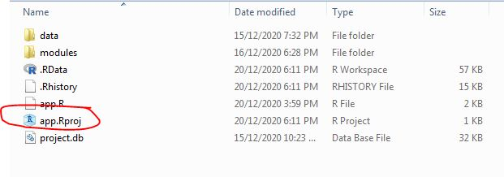

# construction-equipment

## Requirements

This program requires R and RStudio, which can be downloaded and installed
through the following links:

### R

- <https://www.r-project.org/>

### RStudio

- <https://rstudio.com/products/rstudio/download/>

## Run App

Once R and Rstudio has been downloaded and installed, do the following:

1. Open the project, by clicking on `constructin-equipment.Rproj`.

    

2. Run `setup.R`.

    - This will install and load all prerequisite libraries needed.

  

3. Set the input values for `run.R` at the top of the file.

   
4. Run `run.R` and observe results.

 
