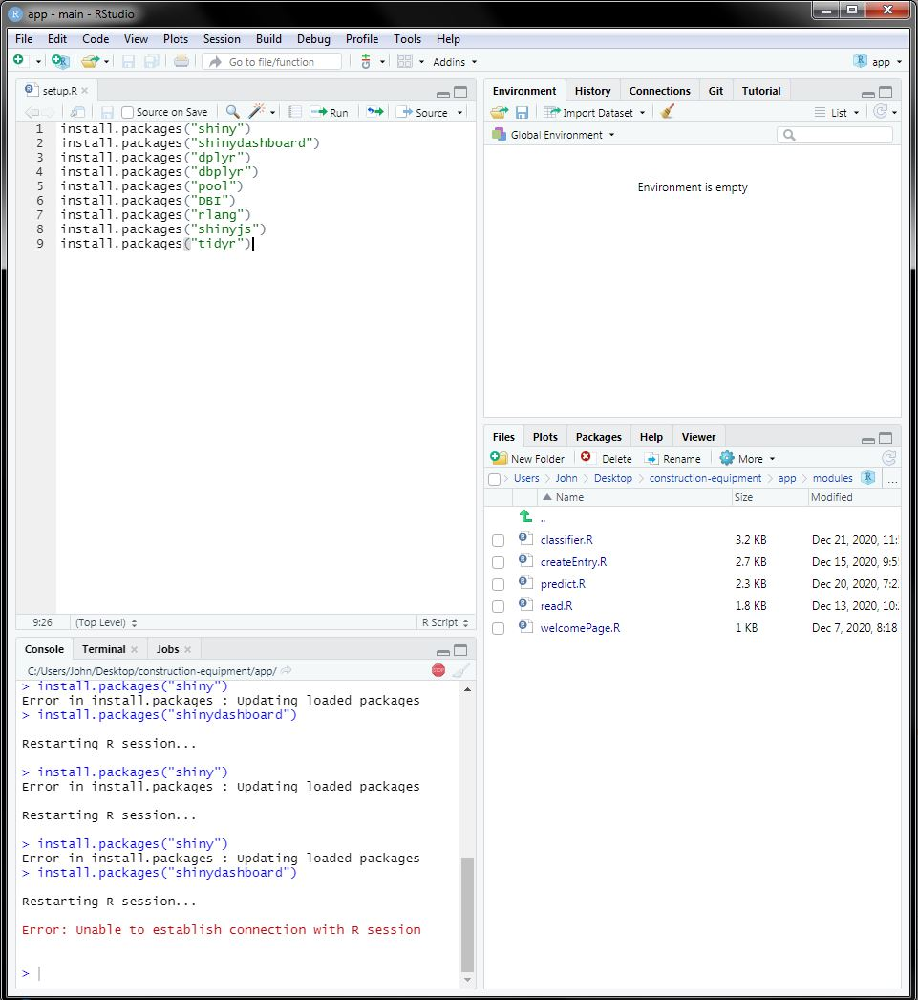

# construction-equipment

## Requirements

This program requires R and RStudio, which can be downloaded and installed
through the following links:

### R

- <https://www.r-project.org/>

### RStudio

- <https://rstudio.com/products/rstudio/download/>

## One Time Install

Go to setup.R and `CTRL`+`A` and then `CTRL`+`ENTER` the entire R script to install all the packages. It may ask you to restart, just keep saying yes until all the packages are installed. 
        
   

## Run App

Once R and Rstudio has been downloaded and installed, do the following:

1. Go to the `app` folder and open the project by clicking on `constructin-equipment.Rproj`.

    

2. Go to the file `app.R`.

     
     

3. Highlight the entire code using `CTRL`+`A` then press `CTRL`+`ENTER`.

4. A new window should open up containing the web program.

    
 
